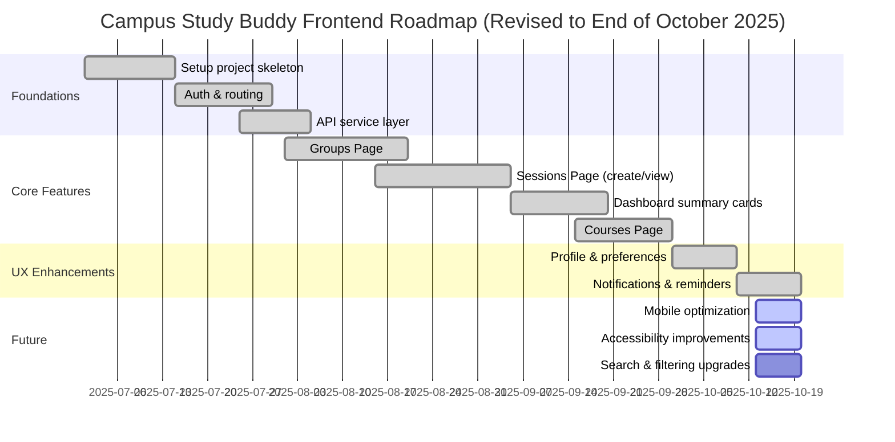

# Roadmap

```mermaid
gantt
    dateFormat  YYYY-MM-DD
    title Campus Study Buddy Frontend Roadmap (Revised to End of October 2025)

    section Foundations
    Setup project skeleton        :done,    des1, 2025-07-01, 2025-07-15
    Auth & routing                :done,    des2, 2025-07-15, 2025-07-30
    API service layer             :done,    des3, 2025-07-25, 2025-08-05

    section Core Features
    Groups Page                   :done,    feat1, 2025-08-01, 2025-08-20
    Sessions Page (create/view)   :done,    feat2, 2025-08-15, 2025-09-05
    Dashboard summary cards       :done,    feat3, 2025-09-05, 2025-09-20
    Courses Page                  :done,    feat4, 2025-09-15, 2025-09-30

    section UX Enhancements
    Profile & preferences         :done,     enh1, 2025-09-30, 2025-10-10
    Notifications & reminders     :done,     enh2, 2025-10-10, 2025-10-20

    section Future
    Mobile optimization           :active,   fut1, 2025-10-13, 2025-10-20
    Accessibility improvements    :active,   fut2, 2025-10-13, 2025-10-20
    Search & filtering upgrades   :active    fut3, 2025-10-13, 2025-10-20

```

<!-- put this at the bottom of docs/operations/roadmap.md -->

